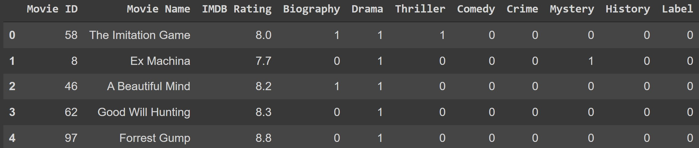

# 6070-CA06-kNN-based-Recommender-Engine

# Objective:
The objective of this project is to build a simple movie recommendation engine using K Nearest Neighbors Machine Learning method. We will get attributes of the movie a user like, input those attributes into our model, and get a list of movies recommended for that user.

# Data: 
The data are using for this project includes 30 movies with a matrix of their genres. 

# Runtime: 
< 1 min

# Possible Improvements:
We can first get a much larger dataset with a lot more movies. Then we can write functions that can take movie name as input from a user, automatically get attributes from the dataset, then output top 5 movies. 
